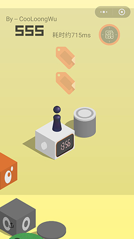
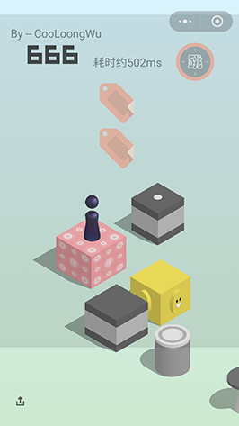

# 微信跳一跳助手

元旦假期前看到了大神的文章《python 微信《跳一跳》辅助》
（知乎地址在这：https://zhuanlan.zhihu.com/p/32452473  GitHub地址在这：https://github.com/wangshub/wechat_jump_game  ），
看完后我想说很棒，但是感觉这对小白来说貌似有点难了，需要工具python（小白问这是个啥）、Adb（小白问这又是个啥）、Matplot（小白不问了，手动去跳一跳了），哈哈哈。   

所以我就在想有没有可以直接装在手机上来辅助的App可以做出来呢，对小白用户来说相对也简单点。  

说做就做吧，凑一波热闹！然后假期里就在想：  

- 这个小游戏其实就是根据触摸屏幕的时间长短来决定小人跳动距离的远近
- 这个小人跳动的速度在设备上是个定值，根据手机不同速度可能不同（如果不定那么这游戏更不好玩了）
- 我需要计算出来小人当前的位置到下一个我要跳到的位置的距离，恩，我用尺子量
- 根据上一条，我觉得我需要“悬浮窗”功能来帮我实现，悬浮窗浮动在微信小游戏的上面，我拖动悬浮窗里面的两个控件来计算两点间的距离
- 恩，不错，感觉能量出来，这尺子不错，距离的问题解决了
- 量出来了距离，速度的话是个定值我多测试几次能测个大概的速度了，后面慢慢优化
- 根据上一条所说，测速，这个就是在adb里面测的了，模拟跳出800ms的距离，然后对比你尺子量出来的，测测测，就有个大概了
- 好了，距离，速度都有了，那么接下来触摸的时间t=距离/速度，搞定，去吧，这一步触摸233ms就能到下一个的中心
- 什么？你不知道触摸233ms是多长时间？罢了罢了，交给手机去“自摸”好了
- 根据上一条，要模拟屏幕触摸事件，那么手机基本需要Root了，Root后应用获取权限，然后执行shell脚本执行自摸搞定

## 悬浮窗权限
做的时候就感觉悬浮窗可能是个坑，需要适配，所以索性GitHub上找了一个悬浮窗库，感谢作者大大
[czy1121/settingscompat](https://github.com/czy1121/settingscompat)

## 展示图片在这里
刷的不高吧，大神说刷高了可能没朋友  

   

## 展示Gif在这里
~~假期懒得出被窝，在床上录的，简单看下床戏吧~~  
正经的录制来了（速度放满了点，大家可以看清楚怎么操作）
 

